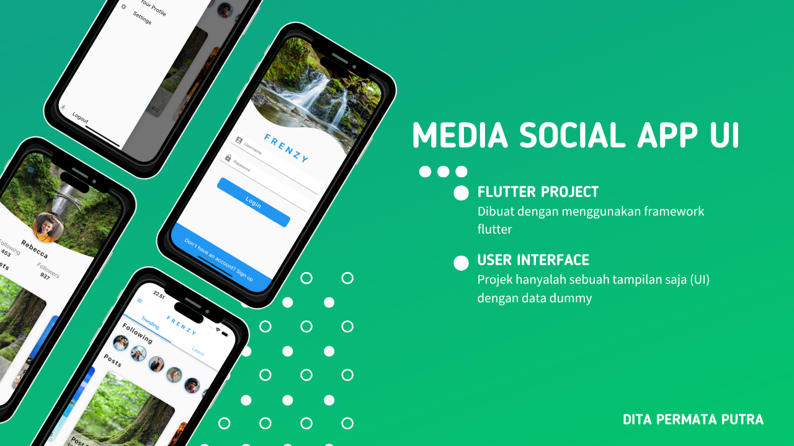

# Media Social App UI

Ini adalah sebuah projek yang dibuat dengan menggunakan framework flutter.

## Screenshots



## Run Locally

Clone the project

```bash
  git clone https://github.com/ditateum/media-social-ap-ui
```

Go to the project directory

```bash
  cd media-social-ap-ui
```

Install dependencies

```bash
  flutter pub get
```

Start the server

```bash
  flutter run lib/main.dart
```
